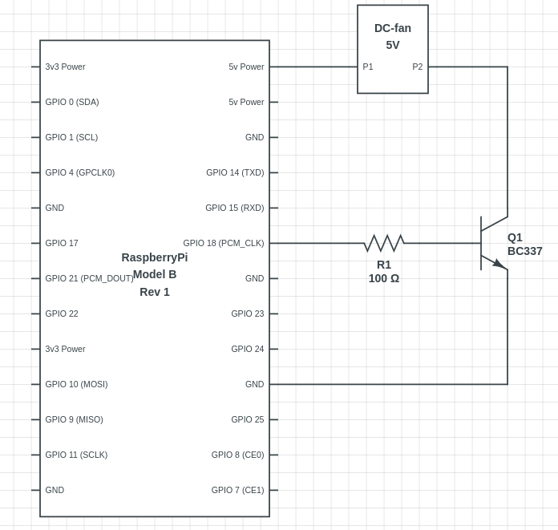

# Pi-fancontrol
The pi-fancontrol program controls an DC-fan controlled by a transistor that is connected with the GPIO (General Purpose Input Output) of the Raspberry Pi. It uses a PWM signal to roughly control the speed of the fan. If you want to control the speed of a DC-fan this is one way of doing it. Obviously it is not the best way but it does the job. For better efficiency and less rumor of the fan use a real PWM-fan for the Raspberry Pi.
## Circuit
If you want to build this cooling system you need:
- DC-fan
- Transistor (I used a [BC337](https://www.onsemi.com/pdf/datasheet/bc337-d.pdf))
- Resistor (I used a 1 kΩ resistor)
The circuit looks like this:

---
## Install
To install the project you need to install the following libaries:
- `libgpiod-dev`
- `libpigpio-dev`
### On Rasperry Pi OS:
```bash
sudo apt install libgpiod-dev libpigpio-dev -y
```
### Make
1. Get this git repository
2. Cd into the directory
3. Run `make`
4. Enable the service with systemctl
```bash
systemctl enable pifancontrol
```
